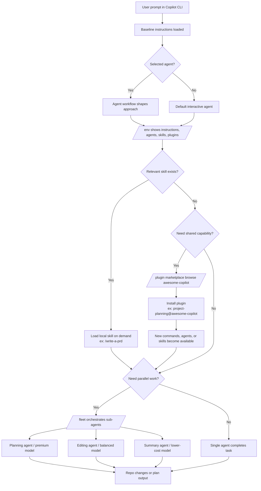

# Workshop 3: Advanced Agent Orchestration & The Copilot CLI

> **Format:** Instructor-led live workshop · **Duration:** 60 minutes · **Level:** Intermediate
> **Topic:** GitHub Copilot CLI slash commands, plan/autopilot workflows, `/fleet` sub-agents, model selection, agent skills, and plugins

This workshop teaches participants how to work effectively in the **GitHub Copilot CLI**: how to inspect the agent environment, switch models, build a plan, hand work to autopilot, split tasks across sub-agents, resume prior sessions, and extend the CLI with reusable skills and plugins.

The session is designed for live delivery: start with a mental model of the CLI, move into short guided activities, and keep the demo grounded in a real repository that already contains a custom agent and a local skill.

---

## Start Here

If you are running the workshop live, start with:

1. [Activity 1 - Inspect the agent environment](./activities/activity-1.md)
2. Then continue to [Activity 2 - Plan mode, autopilot, and `/fleet`](./activities/activity-2.md)
3. Finish with [Activity 3 - Skills, plugins, progressive loading, and shared catalogs](./activities/activity-3.md)

Keep the reference artifacts open alongside the activities:

- [Command cheat sheet](./examples/example-command-cheatsheet.md)
- [Live repo assets](./examples/example-live-repo-assets.md)
- [Fleet prompt example](./examples/example-fleet-prompt.md)
- [Skill and plugin workflow example](./examples/example-skill-workflow.md)

---

## Welcome

- **Who is this for:** Developers who want to move beyond single prompts and use the Copilot CLI as an orchestrated agent workflow
- **What you'll learn:** How to use the Copilot CLI interactively, when to switch into plan or autopilot mode, how `/fleet` parallelizes work across sub-agents, how model selection changes cost/quality tradeoffs, and how skills and plugins extend the agent on demand
- **What you'll use:** This repository, the top-level devcontainer/Codespace, the live repo agent in `.github/agents/`, and the local `write-a-prd` skill in `.github/skills/`
- **How to use this README:** Walk the workshop in order from Section 1 through Activity 3; each section includes the teaching goal, the participant task, and a concrete example you can demo

In this workshop, you will:

1. Explore the Copilot CLI interface and its slash-command categories
2. Inspect the current agent environment, model options, and available skills
3. Use plan mode and autopilot mode for longer-running tasks
4. Coordinate sub-agents with `/fleet` and explicit model instructions
5. Use both a local repo skill and a shared plugin workflow sourced from `github/awesome-copilot`

---

## Learning Objectives

By the end of this workshop, participants will be able to:

1. **Navigate Copilot CLI** using `/help`, `/env`, `/model`, `/agent`, `/skills`, `/plan`, `/resume`, and related commands.
2. **Explain the difference between interactive mode, plan mode, and autopilot mode** and choose the right one for the task.
3. **Use `/fleet` effectively** to break a task into parallel subtasks with separate context windows.
4. **Describe model tradeoffs** and assign different models to different parts of a coordinated workflow.
5. **Use local skills and shared plugins** and explain how skills save context through progressive loading while plugins distribute larger bundles of capabilities.

---

## At a Glance: Instructions vs. Skills vs. Agents vs. Plugins

Use this table early in the session so participants know which customization layer they are looking at.

| Primitive | What it is | Best use | When to reach for it | Example in this repo |
| --------- | ---------- | -------- | -------------------- | -------------------- |
| **Instructions** | Baseline guidance automatically loaded for many tasks | Project-wide rules, conventions, architecture guardrails | Use when you want Copilot to behave differently on **almost every task** | `.github/copilot-instructions.md` or `.github/instructions/*.instructions.md` |
| **Skills** | Task-specific instruction bundles loaded on demand | Repeatable specialized tasks that need detailed guidance, scripts, or references | Use when the behavior is **too detailed to keep in the base prompt**, but should only load when relevant | `.github/skills/write-a-prd/` |
| **Agents** | Reusable personas or workflows that change how Copilot approaches work | Structured workflows, domain specialists, planning roles, routing behavior | Use when you want Copilot to adopt a **specific identity, workflow, or operating mode** | `.github/agents/agentic-workflows.agent.md` |
| **Plugins** | Installable bundles that can include skills, agents, prompts, hooks, and commands | Sharing or adopting a complete toolkit from a marketplace | Use when you want to **bring in a curated package** instead of copying one item at a time | `project-planning@awesome-copilot` |

### Rule of thumb

- Use **instructions** for defaults.
- Use **skills** for deep, on-demand task guidance.
- Use **agents** for identity and workflow.
- Use **plugins** for distribution and discoverability.

---

## Mermaid View: How the Orchestration Layers Fit Together



---

## Prerequisites

**Knowledge**

- Comfortable using the terminal and a code editor
- Comfortable working in a Git repository on a throwaway branch
- Basic understanding of GitHub Copilot concepts such as prompts, instructions, and agents

**Tools & Accounts**

- [ ] GitHub Copilot access with Copilot CLI enabled
- [ ] GitHub authentication working in the terminal
- [ ] Git installed and working
- [ ] A Codespace or dev container for this repository, or a local environment with `copilot` installed

> **Good news:** Workshop 3 is mostly CLI + Markdown workflow. Unlike Workshop 2, you do **not** need to build an app before the workshop can run.

> **Instructor note:** This workshop moves quickly once the CLI is open. Do the environment check before the session starts so the room spends the hour on agent behavior, not login issues.

---

## Quick Setup

### Option A - Use this repository in a Codespace or dev container (recommended)

This repository already contains the workshop content plus two live assets you can demo in the CLI:

- `.github/agents/agentic-workflows.agent.md` - a real custom agent profile
- `.github/skills/write-a-prd/` - a real local skill available to Copilot

To use the repo as the walkthrough environment:

1. Open the repository in **GitHub Codespaces** or **VS Code Dev Containers**
2. Open a terminal in the repo root
3. Start the CLI:

```bash
copilot
```

4. If this is the first launch, authenticate inside the CLI:

```text
/login
```

5. Create the throwaway demo branch inside the CLI workshop flow:

```text
Create and switch to a new git branch named workshop-3-demo before we make any edits in this repository.
```

If you prefer to create the branch manually (instead of asking the CLI), run:

```bash
git switch -c workshop-3-demo
```

6. Run this 30-second dry run:

```text
/help
/env
/skills list
```

If you want to verify plugin-marketplace access too:

```text
/plugin marketplace browse awesome-copilot
```

### Option B - Use another repository

You can run the same exercises in another repository, but the demos will be smoother if that repo already has:

- a `.github/agents/` directory for custom agents
- a `.github/skills/` directory or `~/.copilot/skills/` directory for skills
- a small, safe docs task you can hand to autopilot

### Option C - Run locally on your machine

For **Workshop 3 only**, the minimum local setup is:

1. Clone this repository
2. Install GitHub Copilot CLI
3. Launch `copilot` from the repository root
4. Authenticate with `/login`

#### Install Copilot CLI locally

Choose one installation path from the official docs:

**macOS / Linux**

```bash
brew install copilot-cli
```

or:

```bash
curl -fsSL https://gh.io/copilot-install | bash
```

**Windows**

```powershell
winget install GitHub.Copilot
```

**Cross-platform via npm**

```bash
npm install -g @github/copilot
```

#### Local dry run

From a fresh shell:

```bash
git clone https://github.com/<OWNER>/skills-workshops.git
cd skills-workshops
copilot --version
copilot
```

Then inside the CLI:

```text
/login
/help
/env
/skills list
```

### Pre-flight Check

Before you begin, verify:

1. `copilot --version` returns a version and starts cleanly
2. `copilot` opens the interactive CLI session
3. `/help` shows command groups such as **Agent Environment**, **Models and subagents**, and **Code**
4. `/skills list` shows at least the local `write-a-prd` skill when run from this repository
5. `/plugin marketplace browse awesome-copilot` works in the interactive session, or you know to add the marketplace with `copilot plugin marketplace add github/awesome-copilot`
6. You can authenticate successfully with `/login` if the CLI is not already signed in

### Recommended instructor dry run

Before teaching, do this once in the exact environment you plan to use:

```bash
copilot --version
gh --version
git status
```

Then inside `copilot`:

```text
/help
/env
/skills list
/plugin marketplace browse awesome-copilot
```

If the marketplace is unknown:

```bash
copilot plugin marketplace add github/awesome-copilot
```

Once this setup is done, continue into the Workshop Agenda below and start with Section 1.

---

## Using This Repository as the Live Demo Repo

This repository is intentionally usable as the example repo for the walkthrough.

### What to demo live from this repo

1. **`/agent`** - show the existing `agentic-workflows` agent from `.github/agents/agentic-workflows.agent.md`
2. **`/skills list`** - show the existing `write-a-prd` skill from `.github/skills/write-a-prd/`
3. **`/plugin marketplace browse awesome-copilot`** - show shared extensions coming from the Awesome Copilot marketplace
4. **`/help`** - walk the command groups and highlight `/env`, `/plan`, `/resume`, `/plugin`, and `/chronicle`
5. **`/fleet` + autopilot** - run a docs-only task against the files in this workshop folder on a throwaway branch

### Why this repo works well

- The content is mostly Markdown, so the live task can stay low risk
- The repo already includes a real custom agent and a real skill
- The workshop can also pull in a real shared plugin from `github/awesome-copilot`
- Participants can inspect the workshop files before and after the CLI changes them

### What is already prepared for Codespaces/dev containers

- the repo-level devcontainer installs the Copilot CLI feature
- the terminal opens in the editor by default
- Workshop 3 opens as a suggested starting file
- the repo already contains one local agent and one local skill to demo immediately

---

## Workshop Agenda

| Time        | Section                                                                                                         | Format             | Outcome                                                                 |
| ----------- | --------------------------------------------------------------------------------------------------------------- | ------------------ | ----------------------------------------------------------------------- |
| 00:00-15:00 | [1. Copilot CLI mental model and slash commands](#section-1-copilot-cli-mental-model-and-slash-commands)      | Concept + demo     | Participants understand the CLI surface area and the key command groups |
| 15:00-30:00 | [2. Activity 1 - Inspect the agent environment](#section-2-activity-1---inspect-the-agent-environment)        | Hands-on           | Participants learn to navigate `/help`, `/env`, `/model`, `/agent`, and session commands |
| 30:00-45:00 | [3. Activity 2 - Plan mode, autopilot, and `/fleet`](#section-3-activity-2---plan-mode-autopilot-and-fleet)  | Hands-on           | Participants run a low-risk autonomous workflow and see sub-agents coordinate |
| 45:00-60:00 | [4. Activity 3 - Skills, plugins, progressive loading, and shared catalogs](#section-4-activity-3---skills-plugins-progressive-loading-and-shared-catalogs) | Hands-on + debrief | Participants use a local skill and install a shared plugin from Awesome Copilot |

---

## Section 1: Copilot CLI Mental Model and Slash Commands

**Duration:** 15 minutes
**Format:** Instructor explanation + short live demo

### Teaching Goal

Give participants a reliable mental model of the CLI before they start delegating work: what the command groups mean, what the CLI knows about the current repo, when to inspect the environment, and why plan/autopilot/fleet are separate concepts.

### The CLI mental model

Frame the CLI as three layers:

1. **Current session state** - the current prompt thread, selected model, mode, and permissions
2. **Current workspace state** - the repo, files, agents, skills, and git context available in the working directory
3. **Session history state** - prior sessions you can resume or analyze with `/resume` and, if enabled, `/chronicle`

### Slash-command groups to highlight

When you run `/help`, call out these groups explicitly:

- **Agent Environment** - inspect what the agent knows about the current session and environment
- **Models and subagents** - switch models, inspect agents, and parallelize work
- **Code** - inspect diffs, review changes, and work against the repository

Then demo these individual commands:

- `/env` - inspect the session and repo context
- `/model` - view or change the current model
- `/agent` - inspect available agents and switch if useful
- `/plan` - create a plan before implementation
- `/resume` - return to a prior session
- `/skills list` - inspect available skills
- `/plugin` - inspect installed plugins and browse marketplaces
- `/chronicle` - show that session-history insights exist, with the caveat that this command is experimental

### Possible output from key commands

These do not need to match every machine exactly. They give participants a concrete picture of what they are looking for.

**Example: `/env`**

```text
Environment summary

Workspace:
  cwd: /workspaces/skills-workshops
  git repo: skills-workshops
  branch: workshop-3-demo

Loaded customizations:
  instructions: .github/copilot-instructions.md
  agents: agentic-workflows
  skills: write-a-prd
  plugins: project-planning@awesome-copilot

Capabilities:
  mcp servers: github
  lsp servers: none
```

**Example: `/model`**

```text
Current model

  claude-sonnet-4.5

Available models

  claude-sonnet-4.5
  claude-haiku-4.5
  gpt-5-mini
```

**Example: `/skills list`**

```text
Available skills

  write-a-prd
    Location: .github/skills/write-a-prd
    Description: Create a PRD through user interview, codebase exploration, and module design.
```

**Example: `/agent`**

```text
Available agents

  agentic-workflows
    Source: .github/agents/agentic-workflows.agent.md
    Description: Dispatcher agent for GitHub Agentic Workflows tasks.
```

**Example: `/plugin list`**

```text
Installed plugins

  project-planning@awesome-copilot
  structured-autonomy@awesome-copilot
```

### Important distinction: plan, autopilot, and `/fleet`

- **Plan mode** creates and refines a plan with you still in the loop
- **Autopilot mode** lets Copilot keep taking steps until the task is complete or blocked
- **`/fleet`** breaks a larger task into parallel sub-agent workstreams

Use this line during the workshop:

> "Autopilot is about autonomy across time. `/fleet` is about parallelism across subtasks."

### `/chronicle` caveat

`/chronicle` is an **experimental** feature. If it is not available in the participant's CLI version, treat it as an optional demo and continue with `/resume`.

If it is available, enable experiments first:

```text
/experimental on
/chronicle standup
```

### Suggested live demo

1. Start `copilot` in this repo
2. Run `/help` and scroll through the command groups
3. Run `/env`
4. Run `/agent` and point to the repo's `agentic-workflows` agent
5. Run `/skills list` and point to `write-a-prd`
6. Run `/plugin marketplace browse awesome-copilot`
7. Run `/model` and show participants where model choice lives

---

## Section 2: Activity 1 - Inspect the Agent Environment

**Duration:** 15 minutes
**Format:** Hands-on

📋 **Full instructions:** [activities/activity-1.md](./activities/activity-1.md)
📎 **Relevant examples:** [example-command-cheatsheet.md](./examples/example-command-cheatsheet.md), [example-live-repo-assets.md](./examples/example-live-repo-assets.md)

### What Participants Do

1. Start a Copilot CLI session in this repo
2. Inspect `/help`, `/env`, `/model`, `/agent`, `/skills list`, and `/plugin`
3. Try `/plan` and `/resume`
4. Optionally try `/chronicle` if their CLI version exposes it

### Suggested Example

Use the live repo assets rather than hypothetical ones:

- `/agent` -> `agentic-workflows`
- `/skills list` -> `write-a-prd`
- `/plugin marketplace browse awesome-copilot` -> shared extensions from the Awesome Copilot marketplace

### Success Criteria

- [ ] Participants can find the command groups they need from `/help`
- [ ] Participants can explain what `/env`, `/model`, `/agent`, and `/skills` tell them
- [ ] Participants understand that `/chronicle` may require `/experimental on`

---

## Section 3: Activity 2 - Plan Mode, Autopilot, and `/fleet`

**Duration:** 15 minutes
**Format:** Hands-on

📋 **Full instructions:** [activities/activity-2.md](./activities/activity-2.md)
📎 **Relevant examples:** [example-fleet-prompt.md](./examples/example-fleet-prompt.md), [example-command-cheatsheet.md](./examples/example-command-cheatsheet.md)

### What Participants Do

1. Pick a low-risk Markdown-only task in this workshop folder
2. Use **plan mode** to create an implementation plan
3. Hand the plan to **autopilot**
4. Re-run the task with `/fleet` so the CLI decomposes the work across sub-agents
5. Watch how model choice and subtask framing affect the outcome

### Suggested Example

On a throwaway branch, ask Copilot to improve `examples/example-command-cheatsheet.md` and one README paragraph:

- use a premium model for planning or analysis
- use a cheaper or faster model for straightforward Markdown edits
- use `/tasks` or the CLI status output to observe sub-agent progress

### Success Criteria

- [ ] Participants can switch into plan mode and describe why it is useful
- [ ] Participants can explain when autopilot is appropriate
- [ ] Participants can describe what `/fleet` adds beyond autopilot alone

---

## Section 4: Activity 3 - Skills, Plugins, Progressive Loading, and Shared Catalogs

**Duration:** 15 minutes
**Format:** Hands-on + debrief

📋 **Full instructions:** [activities/activity-3.md](./activities/activity-3.md)
📎 **Relevant examples:** [example-skill-workflow.md](./examples/example-skill-workflow.md), [example-live-repo-assets.md](./examples/example-live-repo-assets.md)

### What Participants Do

1. Inspect and use the local `write-a-prd` skill already included in this repo
2. Compare skills to agents and plugins
3. Browse the `awesome-copilot` marketplace with `/plugin`
4. Install a shared plugin from `github/awesome-copilot` and try one of its commands

### Suggested Example

Use the local skill first:

```text
Use /write-a-prd to draft a PRD in the chat for a follow-up lab to this workshop. Do not create an issue.
```

Then install a shared plugin from the catalog, such as:

- `project-planning@awesome-copilot`
- `structured-autonomy@awesome-copilot`

### Success Criteria

- [ ] Participants can explain the difference between instructions, agents, skills, and plugins
- [ ] Participants can show a local skill in `/skills list`
- [ ] Participants can browse or install a shared plugin from `awesome-copilot`
- [ ] Participants understand that skills are loaded on demand rather than kept in the base prompt all the time

---

## Suggested Walkthrough Order for the Instructor

Use the timed Workshop Agenda above for pacing; use this list as the simplest execution order for a first-time run.

If you want to run this workshop directly from the repo, this is the simplest flow:

1. Open the repo in the devcontainer and create a throwaway branch
2. Show `README.md` and explain where Workshop 3 fits in the series
3. Start `copilot` and walk `/help`, `/env`, `/agent`, `/skills list`, and `/model`
4. Point to the real repo assets:
   - `.github/agents/agentic-workflows.agent.md`
   - `.github/skills/write-a-prd/`
5. Run Activity 1 as orientation
6. Run Activity 2 against a docs-only change in `workshop-advanced-agent-orchestration-copilot-cli/`
7. Finish with Activity 3 and discuss which shared plugin each participant would install first

---

## Example Files

Use the files in [`examples/`](./examples/) as ready-made demo material:

- [`example-command-cheatsheet.md`](./examples/example-command-cheatsheet.md) - key slash commands to highlight
- [`example-fleet-prompt.md`](./examples/example-fleet-prompt.md) - a multi-model `/fleet` prompt you can adapt live
- [`example-skill-workflow.md`](./examples/example-skill-workflow.md) - local-skill plus shared-plugin workflow examples
- [`example-live-repo-assets.md`](./examples/example-live-repo-assets.md) - what this repo already exposes to the CLI

---

## Instructor Notes

### Common questions to answer

**"When should I use autopilot?"**  
When the task is clear, bounded, and safe to hand off without step-by-step steering.

**"When should I use `/fleet`?"**  
When the task can be decomposed into parallel subtasks and you want separate context windows.

**"Do skills replace instructions?"**  
No. Instructions shape baseline behavior. Skills load specialized instructions only when relevant.

**"Why use a plugin instead of copying one skill?"**  
Because a plugin is a distribution unit. It can install a curated bundle of skills, agents, prompts, and commands together.

**"What if `/chronicle` is missing?"**  
Treat it as optional. Show `/resume` instead and explain that `/chronicle` is currently experimental.

### Facilitation tips

- Keep the live task Markdown-only and use a throwaway branch
- Narrate why you pick a model, not just which model you pick
- If a participant's account exposes different model names, tell them to substitute whichever models `/model` shows in their account

### Quick troubleshooting

**`copilot` command not found locally**
Install Copilot CLI with Homebrew, the install script, WinGet, or `npm install -g @github/copilot`, then open a new shell.

**CLI opens but you are not authenticated**
Run `/login` inside the CLI and complete the sign-in flow before the workshop starts.

**`/plugin marketplace browse awesome-copilot` fails**
Register the marketplace once with `copilot plugin marketplace add github/awesome-copilot`, then retry.

**`/skills list` does not show `write-a-prd`**
Make sure `copilot` was launched from the repository root, not from a parent directory or another checkout.

---

## Resources

See [resources.md](./resources.md) for the official docs, command references, and the shared skills and plugins catalogs used in this workshop.
